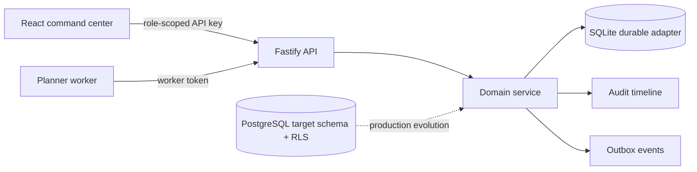

# Asterion Operations

> A maintenance command center for teams that need to prevent asset downtime before it becomes an incident.

Asterion turns fragmented maintenance work into a disciplined operational loop: register assets, model preventive plans, create and dispatch work, protect state transitions, expose SLA risk, and retain an auditable timeline. It is intentionally built as a modular TypeScript system rather than a dashboard mockup.

  

## The operational problem

Plant, facilities, and field-service teams frequently plan maintenance in spreadsheets while urgent failures arrive through chat. The result is invisible overload, missed preventive intervals, fragile handoffs, and no reliable answer to *why did this asset go down?*

Asterion focuses on the first control plane a growing operations organization needs:

- Multi-organization workspaces with role-aware access checks.
- Assets, technician skill profiles, preventive plans, and work-order lifecycles.
- Skill-and-capacity-aware dispatch recommendations.
- Explicit SLA risk states: on track, at risk, and overdue.
- Optimistic concurrency on dispatch and append-only audit/outbox records.
- A planner worker that creates due preventive work and refreshes risk.
- A responsive command-center UI with a live API connection mode.

## Quick start

```bash
cp .env.example .env
npm install
npm run check
npm run dev:api
```

In a second terminal, start the UI:

```bash
npm run dev:web
```

Open `http://localhost:5174`. The console begins in a deliberately labelled demo mode. Create an organization through the API, add memberships for the configured actors, then paste the organization ID and a role-scoped key into the connection panel.

For a local API walkthrough:

```bash
curl -X POST http://localhost:4020/v1/organizations \
  -H 'content-type: application/json' \
  -H 'x-api-key: dev-owner-key' \
  -d '{"slug":"north-plant","name":"North Plant","timezone":"America/Santiago"}'
```

## Architecture



The initial runnable adapter uses a durable SQLite snapshot to keep onboarding lightweight. The normalized PostgreSQL schema in [`packages/storage/migrations/001_operations.sql`](packages/storage/migrations/001_operations.sql) is the production migration target and demonstrates tenant RLS boundaries. See [architecture notes](docs/architecture.md) for the evolution path and non-negotiable invariants.

## Repository map

| Path | Responsibility |
| --- | --- |
| `packages/contracts` | Shared, framework-neutral domain types. |
| `packages/core` | Authorization, lifecycle, planning, audit, and dispatch policy. |
| `packages/storage` | SQLite durable adapter plus PostgreSQL production schema. |
| `apps/api` | Fastify HTTP boundary, schema validation, API-key and worker-token checks. |
| `apps/worker` | Idempotent preventive-planning and risk-refresh loop. |
| `apps/web` | React operational command center. |
| `docs` | API guide, runbook, threat model, ADRs, and product constraints. |

## Quality gates

```bash
npm run build       # compile every workspace
npm run typecheck   # strict TypeScript validation
npm run test        # domain, durable storage, HTTP, worker, and UI tests
npm run check       # full local CI gate
```

The test suite covers role boundaries, duplicate assets, dispatch concurrency, lifecycle transitions, preventive cadence, risk refresh, durable restart behavior, the HTTP workflow, worker authorization, and command-center rendering.

## Deployment posture

`docker compose up --build` runs the API and web console. The worker is deliberately profile-gated because it needs a real organization ID:

```bash
ASTERION_ORGANIZATION_ID=<organization-uuid> docker compose --profile scheduler up --build
```

Before an internet-facing deployment, replace development keys, terminate TLS upstream, rotate the worker token, set a dedicated persistent storage volume, and adopt the PostgreSQL adapter/RLS migration. The [operations runbook](docs/runbook.md) makes those responsibilities explicit.

## Documentation

- [Architecture and invariants](docs/architecture.md)
- [API guide](docs/api.md)
- [Operational runbook](docs/runbook.md)
- [Threat model](docs/threat-model.md)
- [Product decisions](docs/decision-records.md)
- [Contributing](CONTRIBUTING.md)

## License

MIT. See [LICENSE](LICENSE).
