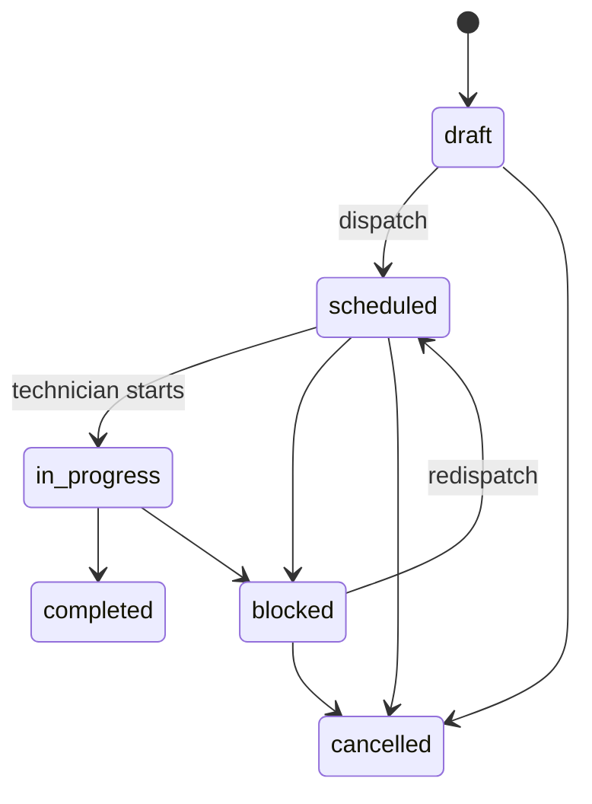

# Architecture and invariants

## Boundary map

The repository is a modular monolith with intentionally narrow seams. `contracts` has no runtime policy. `core` owns every domain rule. Storage implements the core interface, while API and worker are replaceable delivery mechanisms. This keeps dispatch and lifecycle semantics testable without a database or HTTP server.

| Boundary | Owns | Must not own |
| --- | --- | --- |
| Contracts | Stable types and enumerations | Authorization, persistence, timestamps |
| Core | Policy, authorization, state transitions, audit/outbox | Headers, SQL, UI concerns |
| Storage | Durable representation | Business-rule exceptions |
| API | Input validation, authentication translation, response shape | Lifecycle policy |
| Worker | Scheduling and retry boundary | Direct state mutation outside API/core |
| Web | Human decision support | Authorization decisions |

## Domain invariants

1. Every tenant-bound read and mutation starts with an organization boundary.
2. A user needs a membership whose ranked role satisfies the requested operation.
3. Asset codes are unique within an organization after normalization.
4. A technician can only receive work for which they have every required skill.
5. Work-order transitions form a finite state machine; terminal work cannot move again.
6. Dispatch uses a version check so two coordinators cannot silently overwrite each other.
7. Every material domain mutation creates both an audit event and an outbox event.
8. A plan can generate once per cadence day, even if the worker is retried.

## Lifecycle

## Persistence evolution

The built-in adapter persists one transactionally updated JSON snapshot in SQLite. This offers a zero-service local setup and protects against an incomplete process restart; it is not represented as the final multi-node persistence design.

The PostgreSQL migration is normalized, adds meaningful tenant indexes, and enables RLS on every organization-bound table. A production adapter should execute `SET LOCAL app.organization_id = $1` at transaction start, use a migration runner, and publish outbox messages with a lease/claim protocol. The model avoids pretending a local SQLite file solves high availability, background delivery, backups, or online migration.

## Observability contract

- API returns a request ID in its error body, suitable for correlation.
- API logs unhandled errors only; expected domain errors remain structured client responses.
- Worker emits one JSON event per planning tick.
- Audit records answer who changed what; outbox records allow downstream integration without dual-writing.

Operational metrics to add at deployment: planner tick duration and failures, overdue work by asset criticality, dispatch conflicts, unassigned critical work age, and outbox delivery lag.
